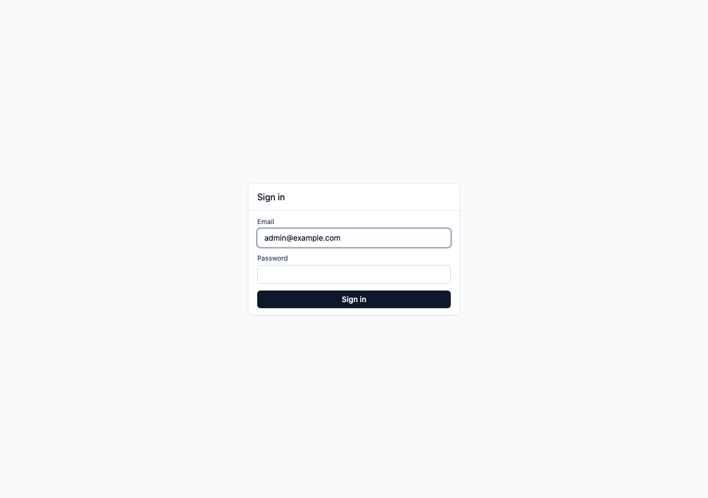

# Getting Started on AWS

The CDK stack in [`infra/cdk/src/stack.ts`](../infra/cdk/src/stack.ts)
synthesises the resource graph described in
[ARCHITECTURE.md](./ARCHITECTURE.md), but it is **synth-only** in v1.
This doc is the punch list of work required to turn it into a running
deployment, ordered by when you'll hit each item.

> The first three sections are the minimum to get a `cdk deploy` that
> produces a working stack. Everything below "Production hardening" can
> be deferred for a v1 internal cutover but should land before exposing
> the public resolver to real customer traffic.

## Phase 1 — Make `cdk deploy` actually work

Fix these and the synthesised stack becomes a runnable deployment.

### 1. Bootstrap the target account

```bash
cdk bootstrap aws://<account>/<region>
```

Required once per account/region before any `cdk deploy`.

### 2. Wire database connection env vars

Tasks currently receive only `DB_PASSWORD`. Both Fargate services need
the rest of the connection string. In `stack.ts`, extend
`taskImageOptions.environment` for both services with:

- `DB_HOST` — `db.dbInstanceEndpointAddress`
- `DB_PORT` — `db.dbInstanceEndpointPort`
- `DB_NAME` — `"flags"`
- `DB_USER` — `"flags"`

Without these, both services will fail their first health check.

### 3. Push container images to ECR

The task definitions pull `ffp/admin-api:latest` and
`ffp/resolver:latest`, but the ECR repos start empty. Add a CI job that:

1. Builds both images.
2. Tags them with the commit SHA **and** `latest`.
3. Pushes to ECR.
4. Triggers an ECS rollout
   (`aws ecs update-service --force-new-deployment` is the simplest
   option; CodeDeploy blue/green if you want gated rollouts).

Prefer the SHA tag for the task-definition image reference — `:latest`
is fine for a first deploy but makes rollbacks fiddly.

### 4. Upload the admin UI to S3

Once deployed, the admin UI is accessed via its CloudFront URL. Log in with the credentials set in `ADMIN_EMAIL` / `ADMIN_PASSWORD`.



The S3 bucket is created empty. CloudFront will serve 404s until it's
populated. Two options:

- **Inline in CDK** — `aws_s3_deployment.BucketDeployment` that takes
  `apps/admin-ui/dist` as its source. Synth depends on a prebuilt
  `dist/`.
- **CI step** — `aws s3 sync apps/admin-ui/dist s3://$BUCKET --delete`
  followed by a CloudFront invalidation on `/*`.

CI step is the more flexible choice once you have a release pipeline.

### 5. Give the admin SPA a path to the admin API

`AdminApi` uses `publicLoadBalancer: false`, so its ALB is only
reachable from inside the VPC. The admin UI runs in a user's browser
served from CloudFront — it has no way to reach the internal ALB
without one of:

- A second CloudFront distribution → **public** ALB for admin-api,
  protected by Cognito / SSO at the edge.
- AWS Client VPN (or another ZTNA path) so operators reach the
  internal ALB directly.
- API Gateway with a private VPC integration.

Pick one before exposing the admin UI to anyone outside the deploying
operator's machine.

## Phase 2 — Custom domains and edge security

### 6. Domains + TLS

The Fargate patterns currently set up HTTP-only listeners and the
CloudFront distributions use the default `*.cloudfront.net` cert.
Required for production:

- Route 53 hosted zone for the platform domain.
- ACM certificates:
  - one in **us-east-1** for CloudFront (admin UI + resolver edge),
  - one regional cert per ALB.
- Set `domainName` + `certificate` on both `ApplicationLoadBalanced
FargateService` constructs.
- Set `domainNames` + `certificate` on both `Distribution`s.
- Alias records pointing the platform domain at CloudFront and (if
  applicable) ALBs.

### 7. Lock the resolver ALB to CloudFront

The public resolver ALB is currently reachable directly on the
internet, so clients can bypass CloudFront. Either:

- Restrict the ALB security group to the AWS-managed CloudFront
  origin-facing prefix list, **or**
- Have CloudFront inject a secret custom header that the ALB rejects
  if absent.

### 8. CI deploy role

CI needs permission to `cdk deploy`, push to ECR, sync the admin UI
bucket, and invalidate CloudFront. Use a GitHub Actions OIDC-federated
IAM role — no long-lived access keys.

## Phase 3 — Production hardening

### 9. Redis encryption + auth

`TransitEncryptionEnabled` and `AuthToken` are both off in the v1
stack. For production, enable both and rotate the auth token through
Secrets Manager. The `REDIS_URL` env var then becomes `rediss://...`.

### 10. Migration safety on >1 admin task

`MIGRATE_ON_BOOT=true` is currently safe only because admin-api runs at
`desiredCount: 1`. If that ever scales, two tasks will race on schema
migrations. Move migrations to a one-shot Fargate task that runs as
part of the deploy pipeline, or guard them with a Postgres advisory
lock.

### 11. Admin bootstrap

Nothing in the stack creates the first admin user, org, or API key.
Add either a seed migration or a one-shot bootstrap task that runs
once per environment.

### 12. Observability

- Set explicit CloudWatch log-group retention (ECS auto-creates them
  with infinite retention by default — pick 14 or 30 days).
- Alarms: ALB 5xx rate, `UnHealthyHostCount`, ECS task count, RDS CPU
  and free storage, Redis evictions, resolver SSE 5xx.
- Optional: X-Ray or OpenTelemetry wiring on both services.

### 13. Auto-scaling

Both services use a fixed `desiredCount`. The resolver in particular
should `autoScaleTaskCount` on CPU **and** ALB request count per
target — SSE connections pin a task to a long-lived TCP slot, so it
needs more headroom than typical request/response services.

### 14. WAF

No web ACL on either CloudFront distribution. At minimum, add IP-based
rate limiting and the AWS-managed common-rule and bot-control sets in
front of the public resolver edge.

### 15. RDS hardening

Flip `deletionProtection` and `multiAz` to `true` for production.
Consider cross-region snapshot copies if RTO/RPO requirements demand
it.

### 16. Multi-environment story

The stack is hardcoded as `FfpStack`. For staging/prod separation,
parameterise by environment, name stacks `Ffp-<env>`, and instantiate
once per environment in `bin.ts`.

## Quick checklist

| Phase | Item                                  | Status |
| ----- | ------------------------------------- | ------ |
| 1     | `cdk bootstrap`                       | ☐      |
| 1     | DB env vars wired into both services  | ☐      |
| 1     | ECR image build + push pipeline       | ☐      |
| 1     | Admin UI deployed to S3 + CF invalid. | ☐      |
| 1     | Admin API reachability for the SPA    | ☐      |
| 2     | Route 53 + ACM + custom domains       | ☐      |
| 2     | Lock resolver ALB to CloudFront       | ☐      |
| 2     | CI OIDC deploy role                   | ☐      |
| 3     | Redis TLS + auth                      | ☐      |
| 3     | Migrations off task boot              | ☐      |
| 3     | Admin bootstrap task                  | ☐      |
| 3     | Log retention + alarms                | ☐      |
| 3     | Resolver auto-scaling                 | ☐      |
| 3     | WAF on public edges                   | ☐      |
| 3     | RDS deletion protection + Multi-AZ    | ☐      |
| 3     | Per-environment stacks                | ☐      |
